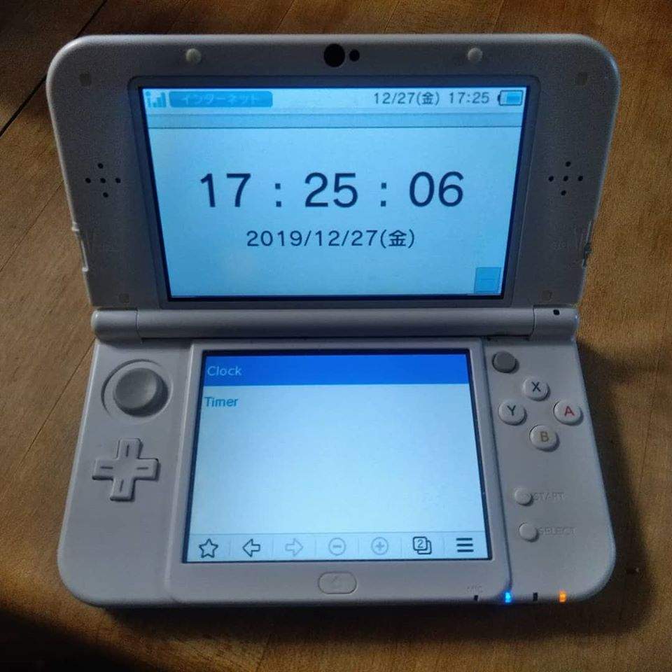

# DSClock



A watch timer app that also supports Nintendo 3DS Internet browsers.

[x] Nintendo 3DS Browser Supported.
[x] Clock Supported.
[ ] Timer Supported.
[ ] Timer Alerm Setting.
[ ] Save Settings.
[ ] Export Settings.
[ ] Offline Support(PWA compatible?).

## How do I test it?

Run the following command with the root directory as the current directory: In addition, PHP is required for operation.

```cmd
php -S 0.0.0.0:8080
```

Once the PHP's built-in server starts, check the IP address of the PC with the `ipconfig` command, etc., and open `http://[IP address]:8080/` from Nintendo 3DS.
